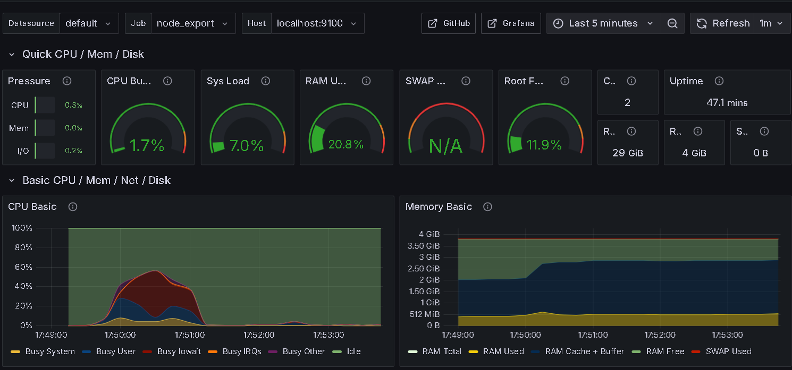

## Set Grafana:

## I Setup grafana by ansible

- be sure you have docker, docker-compose and nginx installed
- go to ansible/observability/metrics/grafana firectory
- adjust inventory files : inventory file add machines and users
- run prometheus_install playbook

```shell
cd DataSources/prometheus && ansible-playbook prometheus_install.yml -i ../../grafana.inventory
```

- run node_exporter_install or/and mysql_exporter_install, cAdvisor_install playbooks

```shell
cd exporters && ansible-playbook  node_exporter_install.yml -i ../../../grafana.inventory
```

- run grafana_install playbook, therea are two options: 
 
    - run with nginx as host/monitor (monitor is default path)
    ```shell
    cd ../../path_based_routing && ansible-playbook grafana_install.yml -i ../grafana.inventory
    ```
    - run with nginx with subdomain
    ```shell
    cd ../../subdomain && ansible-playbook grafana_install.yml -i ../grafana.inventory
    ```
    
- manually add installed datasources and dashboards (1860 for node exporter) - provisionning will be added in future
- check if your grafana instance works on address your_host_ip/monitor
- you can run any exporter and manual add datasource and dashboard at any time

For node exporter it should looks like this:




### more exporters 
https://prometheus.io/docs/instrumenting/exporters/
