## Using Azure Monitor Integration

### 1. Create application register in Azure panel.

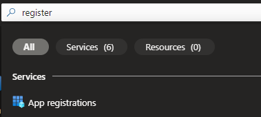

search "App registrations" and click

Register app name with default options

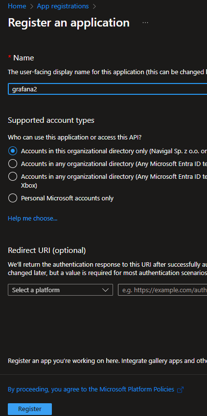

copy ids: 
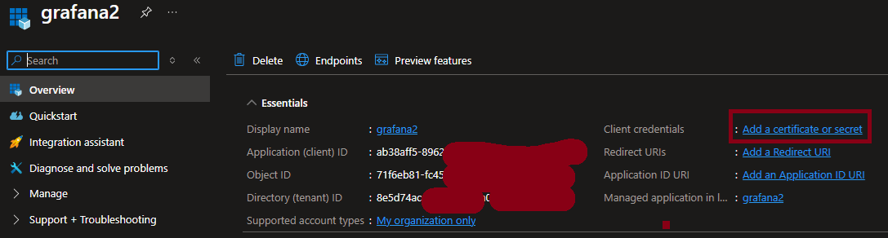

later you will need:
- Directory (tenant) ID
- Application (client) ID
- Client Secret

### 2. Generate Client Secret

Click "Add certificate or secret", then click "New client secret"

Type name and set expiration
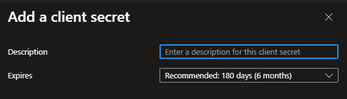

Effect should looks like this

this client secret will be used later

### 3. Assigne role to application

Go to App Registrations

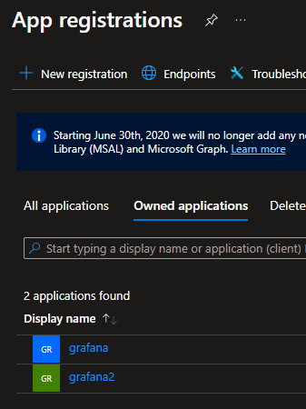

and click your app registration

 and select IAM access controll

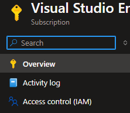

then in left menu click to Access controll (IAM)

and click "Add", then "add role assgignment"

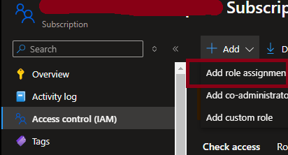

Select role "Reader" 
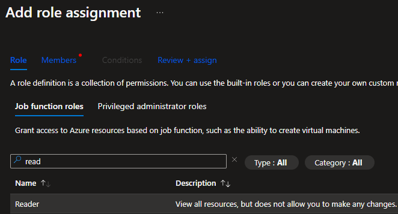

and click "next" at the bottom

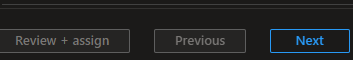

Then select click "+ Select members" and type registered name in popup windows on right

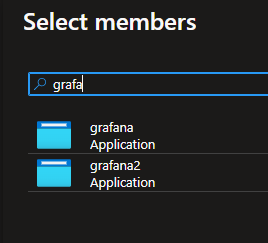

then click "Select"

After that click "Review + assign".

### 4. Set data source in grafana

Go to grafana panel, then in left menu "Connections -> Data Source -> Add new Data source -> Type Azure Monitor and click.

You will have to provide credentials for registered app mentioned above

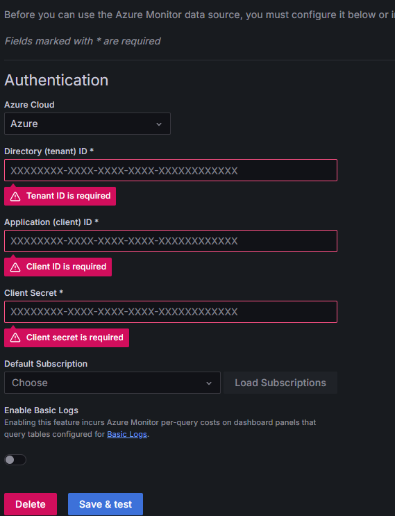

Click Save & test. Don't forget to select default subscription. 

### 5. Import dashboard

Go to [Grafana dashboards website](https://grafana.com/grafana/dashboards/?dataSource=mssql) and pick dashboard id you are interested on. And copy dashboardId. there are many different dashboards depend on resources you use. 

In your grafana panel click "import dashboard"

and paste copied dashboardId and click load

pick azure monitor data source and click "import"

Dashboard should read some data

Example dashboard for virtual machine

