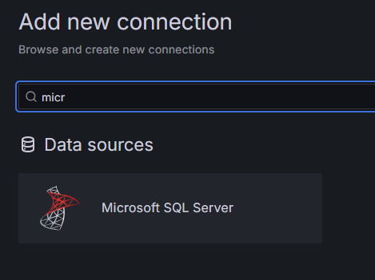
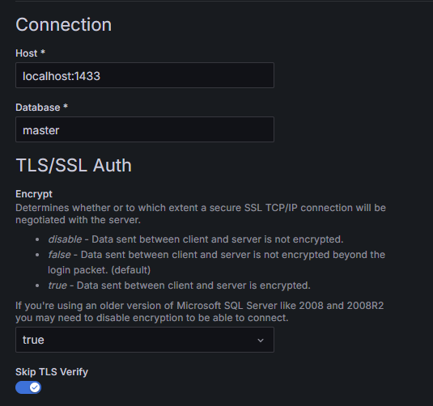
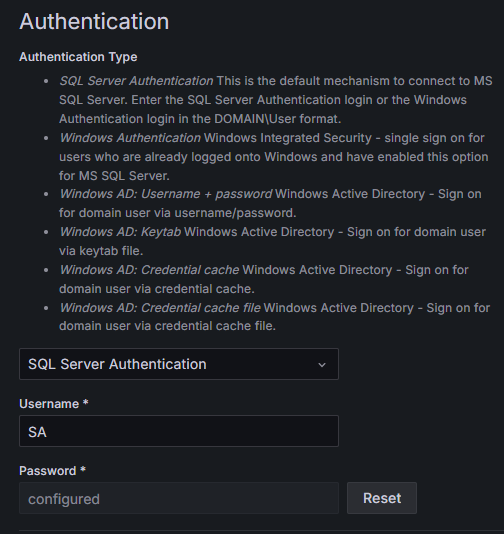
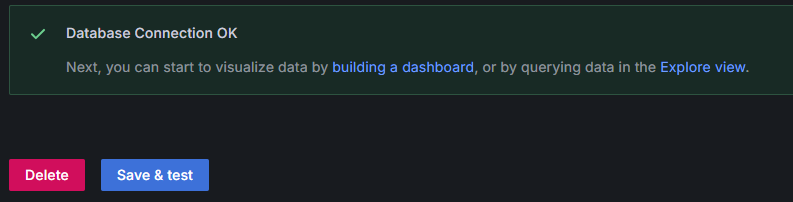
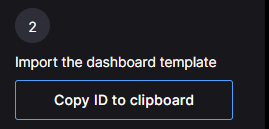
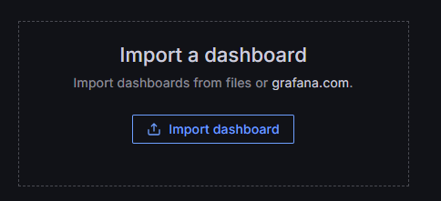
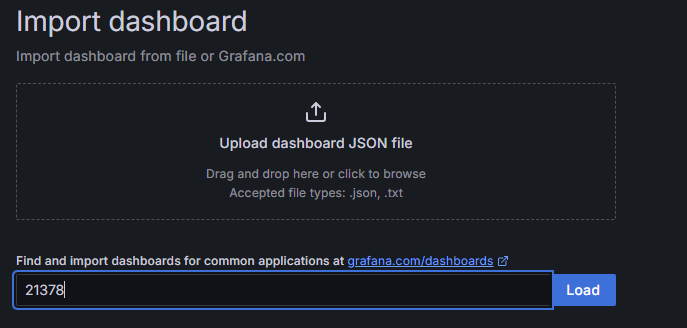
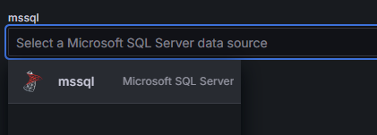
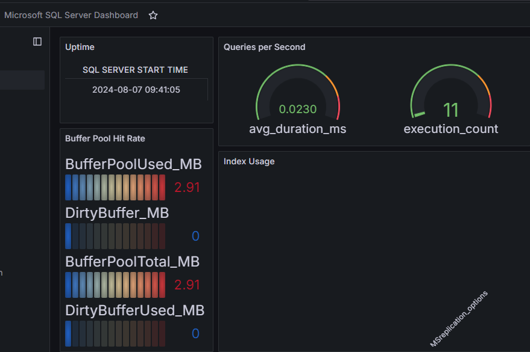

# TODO: add playbook and provisioning

## Provide local or remote Sql Server instance

### 1. Provide local or remote Sql Server instance

You can use playbook from /ansible/basics/databases/mssql/mssql_install.yml or provide accessible database instance.

### 2. Create user for grafana

```sql
CREATE USER grafana WITH PASSWORD 'user_password'
USE <MY_DATABASE>
GRANT SELECT ON DATABASE :: <MY_DATABASE> TO grafana
```

### 3. Add new data source (example will use localhost)



click Add new source button on the right



Select authentication type and provide credentials


click "save & test" and then "building dashboard" link.



### 4. Import dashboard

Go to [Grafana dashboards website](https://grafana.com/grafana/dashboards/?dataSource=mssql) and pick dashboard id you are interested on. And copy dashboardId



In your grafana panel click "import dashboard"



and paste copied dashboardId and click load



pick mssaql data source and click "import"



Dashboard should read some data



