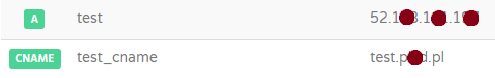
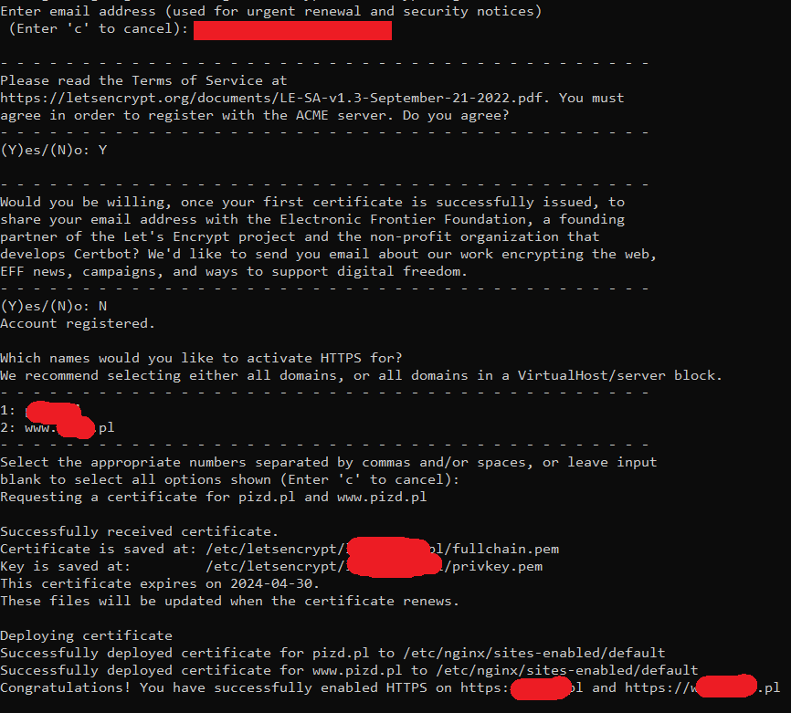
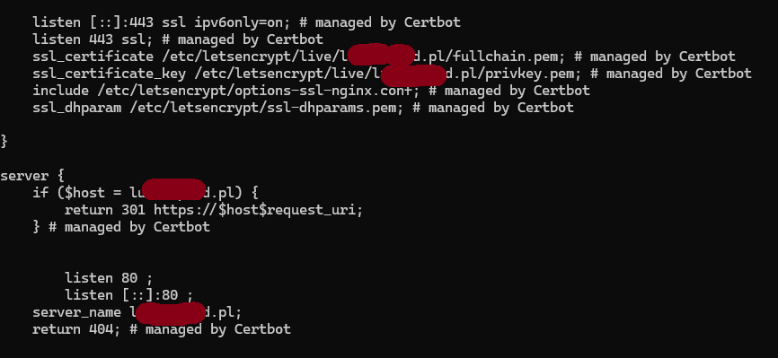

##  1. install nginx if not installed
	```bash
	apt update
	apt install nginx
	systemctl enable nginx.service
	```
or use playbook:

```bash
ansible-playbook ../basics/nginx_install.yml -i inventory
```
create your own inventory file (files named like inventory.local will be ignore by git) or provide proper path to inventory with ip of your hosts. 

should see nginx default page on http://machine_ip.xy

## 2. set domain
log to your domain provider and add two records: A with ip and subdomain and CNAME with value subdomain.your_domain.



after that you should see default nginx website on set address

## 3. Adjust firewall rules
When you use terraform script from this repository - network has open ports: 80, 22 and 443, that allows you to serve http content via nginx. 
If you want to use host firewall for ubuntu follow this article: https://www.digitalocean.com/community/tutorials/how-to-install-nginx-on-ubuntu-20-04

## 4. Install Certbot

- update apt get

```bash
apt-get update 
```
then install packages:

```bash
apt-get install python3 python3-venv libaugeas0
```

setup virtual envs:
```bash
python3 -m venv /opt/certbot/
/opt/certbot/bin/pip install --upgrade pip
```

install certbot:
```bash
/opt/certbot/bin/pip install certbot certbot-apache
/opt/certbot/bin/pip install certbot certbot-nginx
```
then link files:
```bash
ln -s /opt/certbot/bin/certbot /usr/bin/certbot
```

#### Create an SSL Certificate with Certbot

```bash
certbot --nginx
```


console will prompt you to pass email and few consents, after that it will generate and deploy certificate.


From this moment you can enjoy new secured connection on your domain. Paste https://your_domain to browser.

Now your nginx file has redirect added by certbot:


## 5 Set automatic certificate renew 

Time to set automatic renew certificate by cron job that are part of linux system:

in /etc/cron.weekly (there is a lot directories cron.daily, cron.monthly and so on, that contains scripts that will be run with selected frequency)
create file certbot.sh with following content:


```bash
nano /etc/cron.weekly/certbot.sh
```

```bash
#!/bin/sh
/usr/bin/certbot renew > /dev/null 2>&1
systemctl restart nginx
```

and change file mod to make it executable

```bash
chmod +x /etc/cron.weekly/certbot.sh
```

## 6. Generate wild card certificate

Install cerrtbot if not installed (4). Then request certificate:

```bash
	certbot certonly --manual --preferred-challenges=dns --email test@test.com
```
